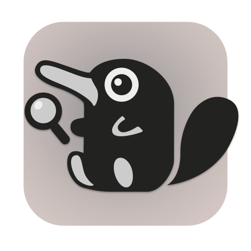

# Sniffler 

Sniff out stuff about your files.

## Installation

### With [rye](https://rye.astral.sh/)

```bash
rye init . --virtual
rye sync --no-dev
```

### With pip

Suggested to use a [virtual environment](https://packaging.python.org/en/latest/guides/installing-using-pip-and-virtual-environments/).

```bash
pip install -r requirements.lock
pip install .
```

## Usage

### GUI version

Run the following command to start the GUI version of sniffler

```bash
sniffler
```
or

```bash
python src/sniffler/gui.py 
```

### Django Web GUI

To run the Django web GUI, follow these steps:

1. Apply migrations:
    ```bash
    rye run dj migrate
    ```

2. Create a superuser:
    ```bash
    rye run dj createsuperuser
    ```

3. Run the development server:
    ```bash
    rye run dj runserver
    ```

4. Access the web GUI at `http://127.0.0.1:8000/`.

#### Testing the Django Web GUI

To test the Django Web GUI run:

```bash
rye run dj test sniffler.web_ui
```

### CLI version

```bash
> sniffler-cli -h
usage: sniffler [-h] [-O OUTPUT] [--delimiter DELIMITER] path

Collect information about files in a directory.

positional arguments:
  path                  The path to the directory to collect information from.

options:
  -h, --help            show this help message and exit
  -O OUTPUT, --output OUTPUT
                        The path to the output file.
  --delimiter DELIMITER
                        The delimiter to use in the output file (',', ';', or 'tab').
  --search SEARCH       Search for files containing the given string in filename or attributes.
```

Alternatively, you can run `src/sniffler` directly.
```bash
python src/sniffler -h
```

This will collect information about the files in the current directory and output it to `output.csv`.
```bash
sniffler . -O output.csv
```

Note: When no output file is specified, the output will be printed to the console as a CSV.